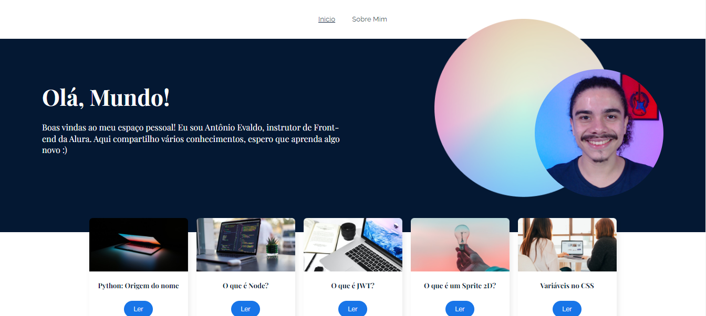
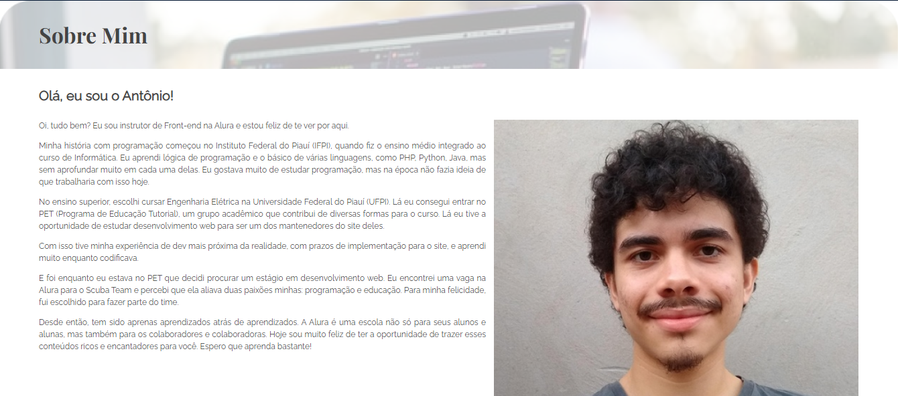
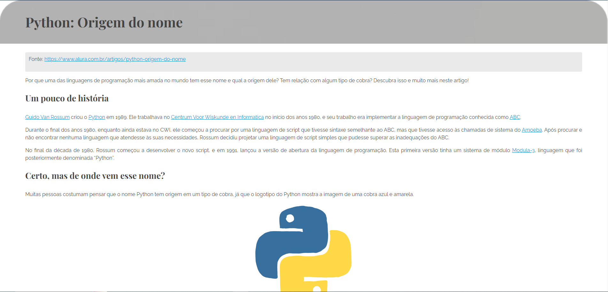

# Projeto Ola-mundo

Projeto desenvolvido durante o curso de React: desenvolvendo em React Router com JavaScript

# Principais tecnologias utilizadas no projeto
* React
* NodeJs
* React-Router-DOM
* React-Markdown

# Imagens do projeto

Imagem contendo o conteúdo da pagina inicial do projeto

Imagem contendo o conteúdo da pagina sobre

Imagem contendo o conteúdo  de um post
